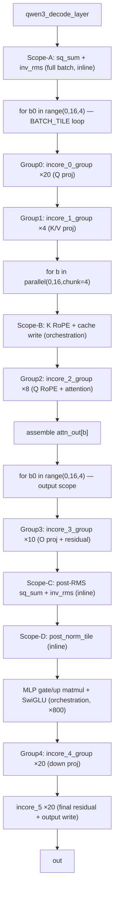
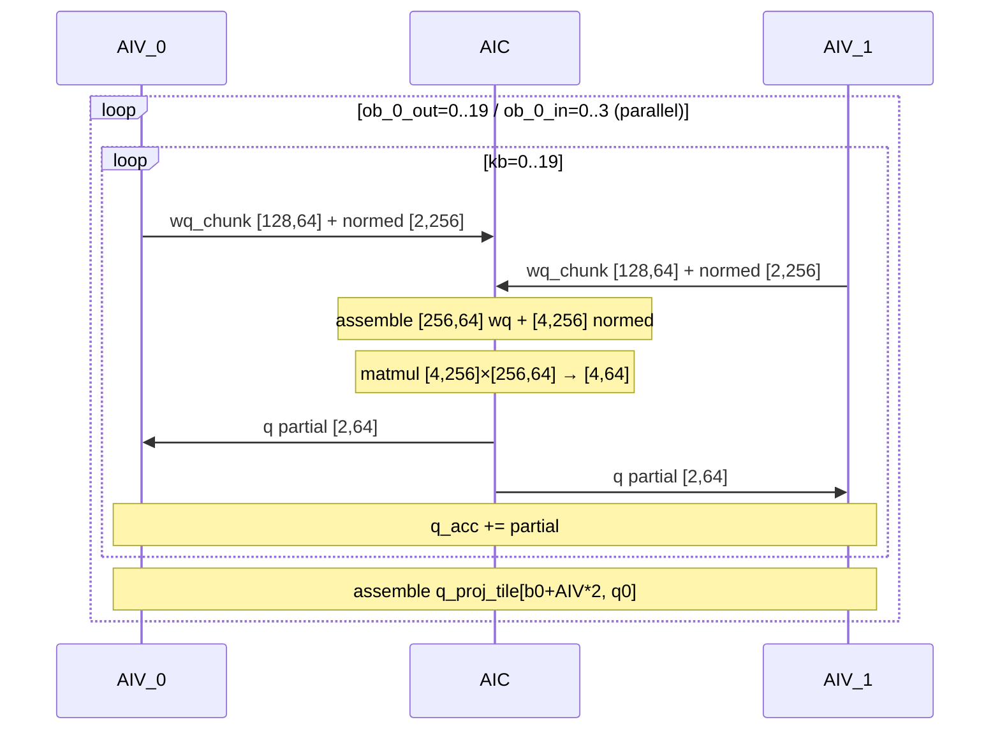
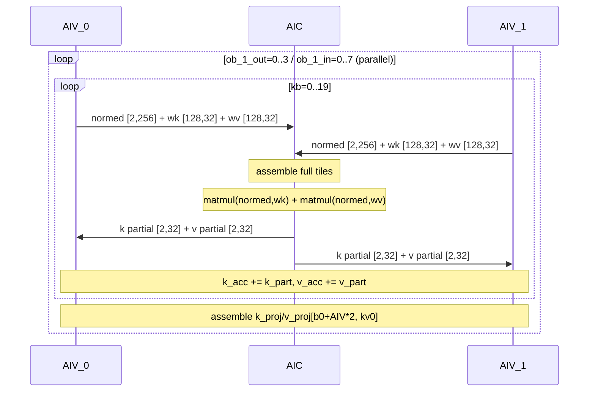
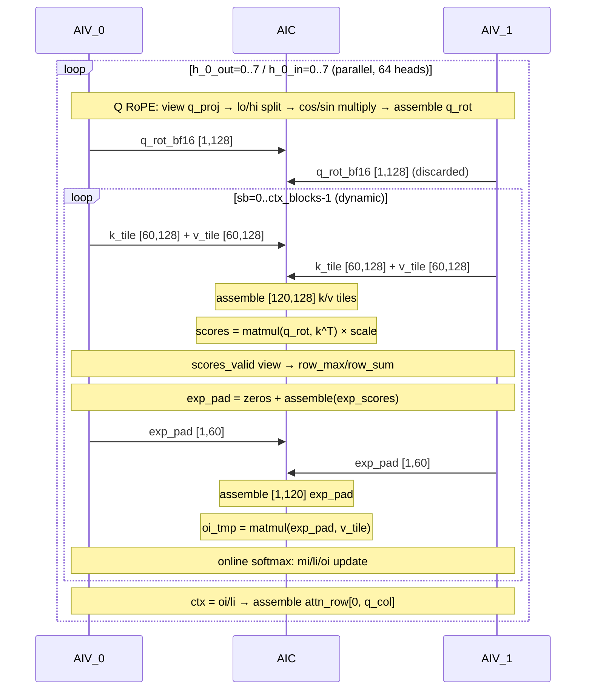
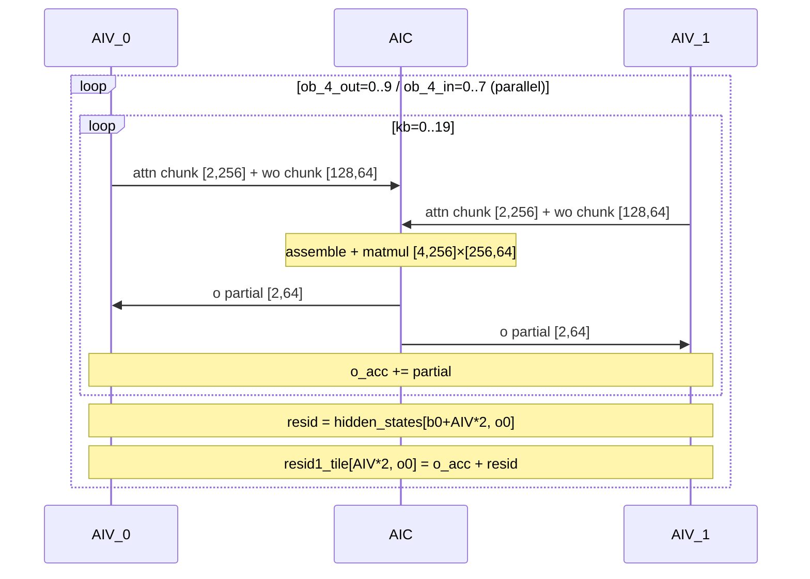
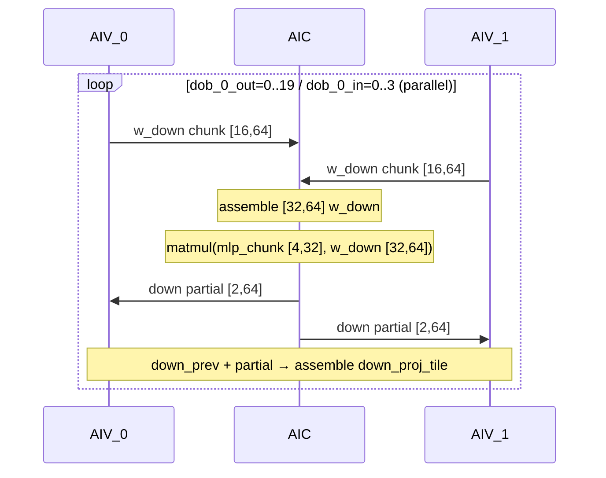
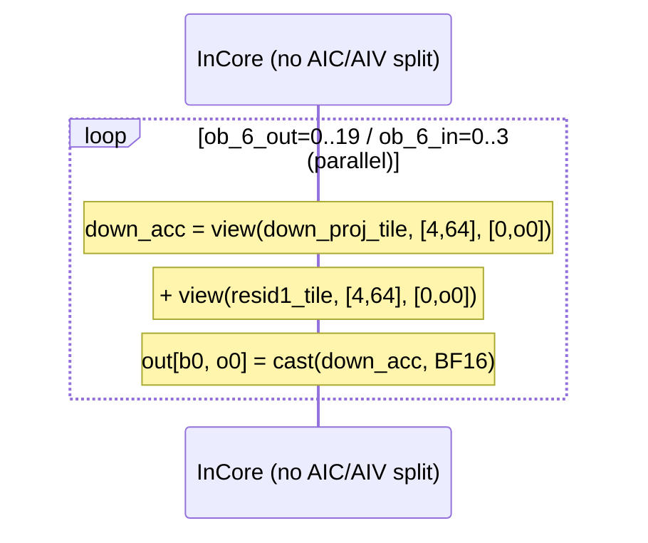

# Qwen3-32B Decode Kernel Flow Analysis (Pass 08)

基于 `passes_dump/08_after_ExpandMixedKernel.py`，当前 decode 已展开为 5 个 mixed kernel group + 1 个 solo InCore function：

- `qwen3_decode_layer_incore_0_group` (AIC+AIV): Q projection
- `qwen3_decode_layer_incore_1_group` (AIC+AIV): K/V projection
- `qwen3_decode_layer_incore_2_group` (AIC+AIV): RoPE + attention (Q RoPE on AIV, scores/oi on AIC)
- `qwen3_decode_layer_incore_3_group` (AIC+AIV): O projection + residual
- `qwen3_decode_layer_incore_4_group` (AIC+AIV): MLP down projection
- `qwen3_decode_layer_incore_5` (solo InCore): final residual add + output assemble

---

## 1) Top-Level Flow (Orchestration)



### Key Structural Differences from Prefill

| Aspect | Decode | Prefill |
|--------|--------|---------|
| Token count | 1 per session (fixed) | 1..MAX_SEQ per session (variable) |
| Outer dynamic loop | None — batch loop is fixed | `for p0_idx in range(tok_blocks)` |
| Scope 1 (Q/K/V proj) | Single `auto_incore` over full batch | Per-token-tile `auto_incore` |
| Scope 2 (attention) | K RoPE at orchestration; Q RoPE in Group2 AIV | All RoPE + cache in Group2 AIV |
| MLP gate/up | Orchestration-level matmul (small [4,32] tiles) | Orchestration-level matmul ([4,256] tiles) |
| Final output | Solo InCore (incore_5) | Fused into Group4 (conditional `ob==MLP_OUT_BLOCKS-1`) |

---

## 2) Detailed Orchestration Trace

### Phase 1: RMSNorm + Q/K/V Projection

```
sq_sum: [16,1] ← inline loop kb=0..19, row_sum(x² chunks)
inv_rms: [16,1] ← rsqrt(sq_sum * HIDDEN_INV + EPS)

for b0 in range(0, 16, 4):             # BATCH_TILE=4
    inv_rms_tile = view(inv_rms, [4,1], [b0, 0])

    for ob_0_out in range(20):          # Q_OUT_BLOCKS/4 = 80/4 = 20
        call_group(incore_0_group)      # Q proj: inner parallel 4, total 80 chunks
                                        # AIV: load x_chunk [4,128], gamma, norm → push normed+wq to AIC
                                        # AIC: assemble [4,256] normed + [256,64] wq → matmul → push [2,64] to AIV
                                        # AIV: accumulate q_acc [2,64] over 20 kb → assemble q_proj

    for ob_1_out in range(4):           # KV_OUT_BLOCKS/8 = 32/8 = 4
        call_group(incore_1_group)      # K/V proj: inner parallel 8, total 32 chunks
                                        # AIV: load x_chunk, gamma, norm → push normed+wk+wv to AIC
                                        # AIC: matmul(normed, wk), matmul(normed, wv) → push to AIV
                                        # AIV: accumulate k_acc, v_acc → assemble k_proj, v_proj
```

### Phase 2: RoPE + Cache Update + Attention

```
for b in parallel(0, 16, chunk=4):
    ctx_len = tensor.read(seq_lens, [b])
    pos = ctx_len - 1
    ctx_blocks = ⌈ctx_len / 120⌉
    cos/sin views at position pos

    for kvh in parallel(0, 8, chunk=4):     # K RoPE + cache write (orchestration level)
        k_row = cast(view(k_proj, [1,128], [b, kv_col]))
        k_rot = RoPE(k_row, cos, sin)
        k_cache[b, kvh, pos] = cast(k_rot, BF16)
        v_cache[b, kvh, pos] = view(v_proj, [1,128], [b, kv_col])

    for h_0_out in range(8):                # 64 heads / 8 inner = 8 outer
        call_group(incore_2_group)          # Q RoPE + attention
                                            # AIV: Q RoPE → push q_rot to AIC
                                            # AIV: load k_tile [60,128], v_tile [60,128] → push to AIC
                                            # AIC: assemble [120,128] tiles, matmul(q, k^T), scores
                                            # AIV: softmax workaround (scores_valid, exp_pad)
                                            #      push exp_pad to AIC
                                            # AIC: matmul(exp_pad, v) → oi_tmp
                                            # AIV: online mi/li/oi update
                                            # AIV: ctx = oi / li → assemble attn_row

    attn_out[b] = assemble(attn_out, attn_row, [b, 0])
```

### Phase 3: Output Projection + MLP + Output

```
for b0 in range(0, 16, 4):
    for ob_4_out in range(10):              # Q_OUT_BLOCKS/8 = 80/8 = 10
        call_group(incore_3_group)          # O proj + residual
                                            # AIV: load attn_out chunk + wo chunk → push to AIC
                                            # AIC: matmul → push to AIV
                                            # AIV: accumulate o_acc + residual → assemble resid1_tile

    sq_sum, inv_rms (inline post-RMS)
    post_norm_tile (inline norm + assemble)

    for ob_5 in range(800):                 # MLP_OUT_BLOCKS = 25600/32 = 800
        gate_acc, up_acc = 0
        for kb in range(20):                # orchestration-level matmul
            matmul(post_chunk [4,256], wg [256,32]) → gate_acc
            matmul(post_chunk [4,256], wu [256,32]) → up_acc
        sigmoid = 1 / (1 + exp(-gate_acc))
        mlp_chunk = gate_acc * sigmoid * up_acc
        mlp_chunk_bf16 = cast(mlp_chunk, BF16)

        for dob_0_out in range(20):         # Q_OUT_BLOCKS/4 = 80/4 = 20
            call_group(incore_4_group)      # down proj
                                            # AIV: load w_down [16,64] → push to AIC
                                            # AIC: assemble [32,64] w_down, matmul(mlp [4,32], w_down)
                                            # AIC: push [2,64] → AIV
                                            # AIV: down_prev + partial → assemble down_proj_tile

    for ob_6_out in range(20):              # Q_OUT_BLOCKS/4 = 80/4 = 20
        incore_5(...)                       # solo InCore (no AIC/AIV split)
            down_acc = view(down_proj_tile) + view(resid1_tile)
            out[b0, o0] = cast(down_acc, BF16)
```

---

## 3) Group-by-Group Flow Charts

### Group 0: `qwen3_decode_layer_incore_0_group` — Q Projection



### Group 1: `qwen3_decode_layer_incore_1_group` — K/V Projection



### Group 2: `qwen3_decode_layer_incore_2_group` — RoPE + Attention



### Group 3: `qwen3_decode_layer_incore_3_group` — O Projection + Residual



### Group 4: `qwen3_decode_layer_incore_4_group` — MLP Down Projection



### Solo InCore 5: `qwen3_decode_layer_incore_5` — Final Residual + Output



---

## 4) AIC/AIV Split Dimensions (SPMD 2-way)

| Group | AIC tile | AIV_0 tile | AIV_1 tile | Split axis |
|-------|---------|-----------|-----------|------------|
| Group 0 (Q proj) | normed [4,256], wq [256,64] | normed [2,256], wq [128,64] | normed [2,256], wq [128,64] | rows (batch) + rows (hidden) |
| Group 1 (K/V proj) | normed [4,256], wk/wv [256,32] | normed [2,256], wk/wv [128,32] | normed [2,256], wk/wv [128,32] | rows (batch) + rows (hidden) |
| Group 2 (attention) | k_tile [120,128], v_tile [120,128] | k_tile [60,128], v_tile [60,128] | k_tile [60,128], v_tile [60,128] | rows (seq) |
| Group 3 (O proj) | attn [4,256], wo [256,64] | attn [2,256], wo [128,64] | attn [2,256], wo [128,64] | rows (batch) + rows (hidden) |
| Group 4 (down) | w_down [32,64] | w_down [16,64] | w_down [16,64] | rows (intermediate) |
| incore_5 (solo) | N/A — no split | — | — | — |

---

## 5) Notes

- 当前 pass 8 结果下，gate/up MLP 计算（800 个 [4,32] matmul）保持在 orchestration 层级，因为 `MLP_OUT_CHUNK=32` 较小，未被分拆为 AIC+AIV group。
- `incore_5`（final residual + output write）也未被分拆，作为 solo InCore 函数运行——仅做简单的 add + cast + assemble。
- `incore_2_group` 仍是最复杂的 kernel（RoPE、cache tile DMA、两次 matmul、online softmax），是性能调优的优先点。
- K RoPE + cache write 在 orchestration 层完成（decode 只有 1 个新 token，不值得放入 kernel），而 Q RoPE 在 Group 2 的 AIV 中完成。
- 与 prefill 相比，decode 的 Group 4 输出和 final residual 是分离的（Group 4 → incore_5），而 prefill 将它们 fused 在 Group 4 内（通过 `ob==MLP_OUT_BLOCKS-1` 条件）。
