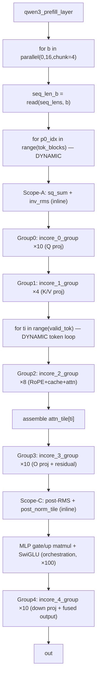
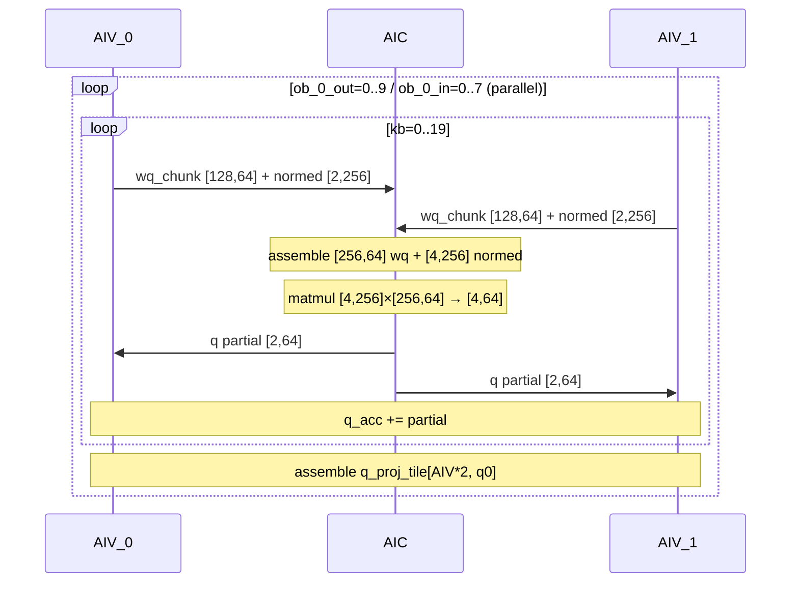
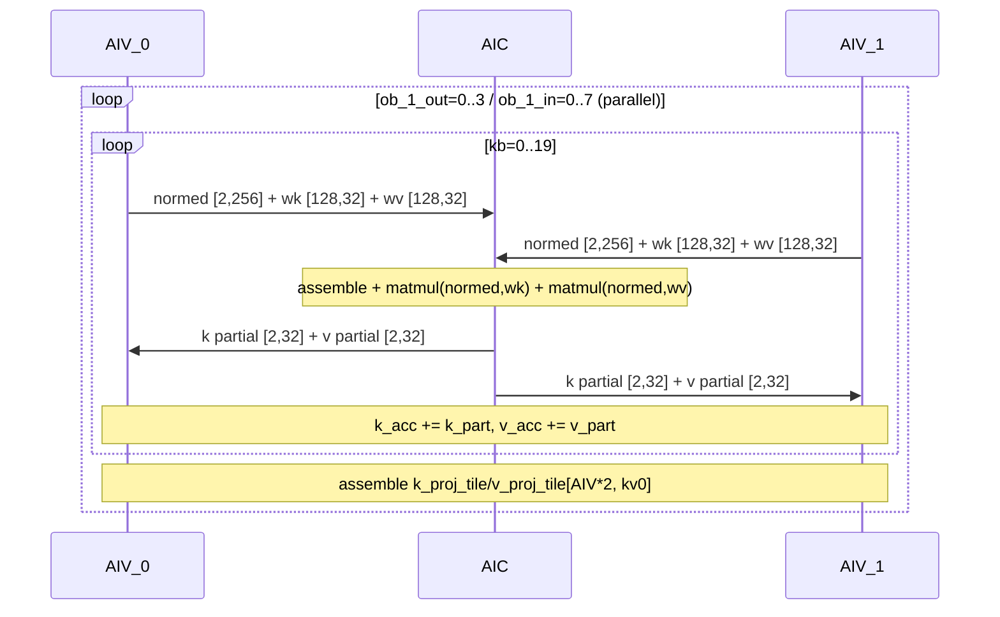
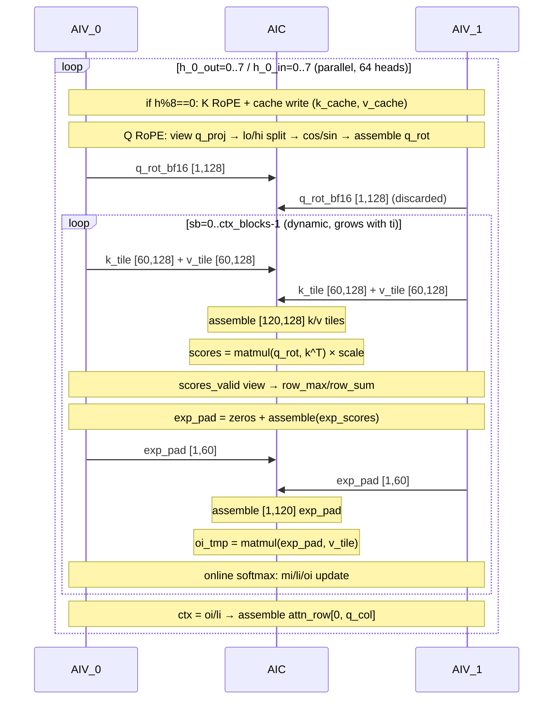
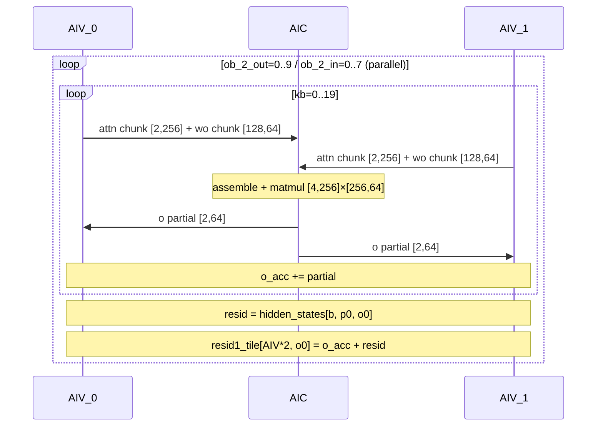
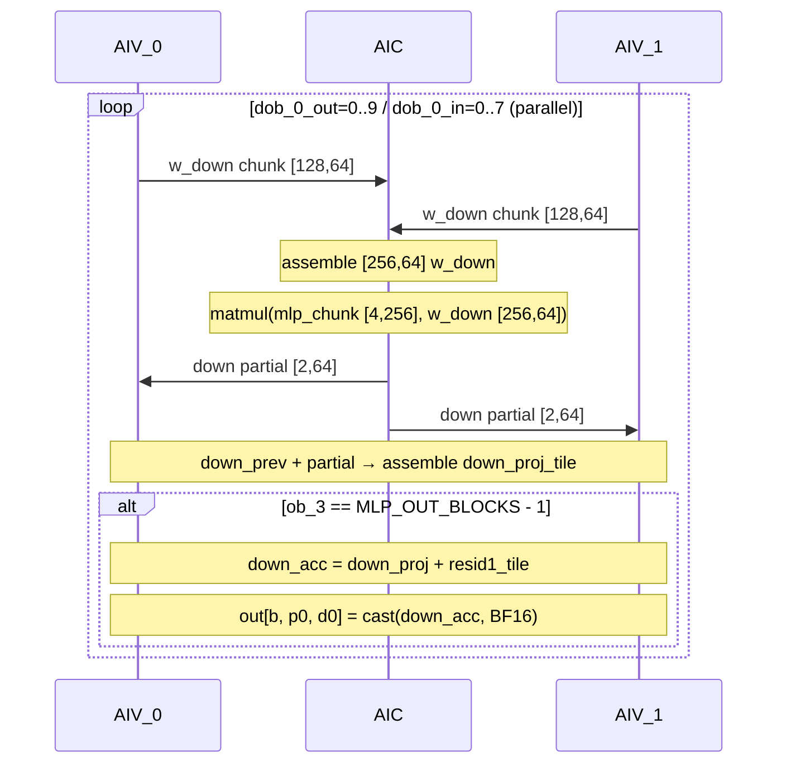

# Qwen3-32B Prefill Kernel Flow Analysis (Pass 08)

基于 `passes_dump/08_after_ExpandMixedKernel.py`，当前 prefill 已展开为 5 个 mixed kernel group：

- `qwen3_prefill_layer_incore_0_group` (AIC+AIV): Q projection
- `qwen3_prefill_layer_incore_1_group` (AIC+AIV): K/V projection
- `qwen3_prefill_layer_incore_2_group` (AIC+AIV): RoPE + cache update + attention core
- `qwen3_prefill_layer_incore_3_group` (AIC+AIV): O projection + residual
- `qwen3_prefill_layer_incore_4_group` (AIC+AIV): MLP down + final residual/writeback (fused via `ob==MLP_OUT_BLOCKS-1` condition)

---

## 1) Top-Level Flow (Orchestration)



---

## 2) Detailed Orchestration Trace

### Phase 1: RMSNorm + Q/K/V Projection (per token tile)

```
for b in parallel(0, 16, chunk=4):
    seq_len_b = tensor.read(seq_lens, [b])
    tok_blocks = ⌈seq_len_b / TOK_TILE⌉              # DYNAMIC per session

    for p0_idx in range(tok_blocks):                   # DYNAMIC loop
        p0 = p0_idx * 4
        valid_tok = min(4, seq_len_b - p0)

        sq_sum: [4,1] ← inline loop kb=0..19, row_sum(x² chunks)
        inv_rms: [4,1] ← rsqrt(sq_sum * HIDDEN_INV + EPS)

        for ob_0_out in range(10):                     # Q_OUT_BLOCKS/8 = 80/8 = 10
            call_group(incore_0_group)                 # Q proj: inner parallel 8
                                                       # AIV: load x_chunk [4,128], gamma, norm
                                                       #      → push normed+wq to AIC
                                                       # AIC: assemble [4,256]+[256,64] → matmul
                                                       # AIV: accumulate q_acc → assemble q_proj_tile

        for ob_1_out in range(4):                      # KV_OUT_BLOCKS/8 = 32/8 = 4
            call_group(incore_1_group)                 # K/V proj: inner parallel 8
```

### Phase 2: RoPE + Cache Update + Attention (per token in tile)

```
        for ti in range(valid_tok):                    # DYNAMIC per token
            pos = p0 + ti
            ctx_len = pos + 1
            ctx_blocks = ⌈ctx_len / 120⌉
            cos/sin views at position pos

            for h_0_out in range(8):                   # 64 heads / 8 inner = 8 outer
                call_group(incore_2_group)             # RoPE + cache + attention
                                                       # AIV: K RoPE + cache write (h%8==0 only)
                                                       # AIV: Q RoPE → push q_rot to AIC
                                                       # AIV: load k_tile [60,128] → push to AIC
                                                       # AIC: assemble [120,128], matmul(q,k^T)
                                                       # AIV: softmax workaround + exp_pad → push
                                                       # AIC: matmul(exp_pad, v) → oi_tmp
                                                       # AIV: online mi/li/oi update
                                                       # AIV: ctx = oi/li → assemble attn_row

            attn_tile[ti] = assemble(attn_tile, attn_row, [ti, 0])
```

### Phase 3: Output Projection + MLP + Output (per token tile)

```
        for ob_2_out in range(10):                     # Q_OUT_BLOCKS/8 = 80/8 = 10
            call_group(incore_3_group)                 # O proj + residual
                                                       # AIV: load attn chunk + wo chunk → push
                                                       # AIC: matmul → push to AIV
                                                       # AIV: o_acc + hidden_states residual
                                                       #      → assemble resid1_tile

        sq_sum, inv_rms (inline post-RMS)
        post_norm_tile (inline norm + assemble)

        for ob_3 in range(100):                        # MLP_OUT_BLOCKS = 25600/256 = 100
            gate_acc, up_acc = 0
            for kb in range(20):                       # orchestration-level matmul
                matmul(post_chunk [4,256], wg [256,256]) → gate_acc
                matmul(post_chunk [4,256], wu [256,256]) → up_acc
            sigmoid = 1 / (1 + exp(-gate_acc))
            mlp_chunk = gate_acc * sigmoid * up_acc
            mlp_chunk_bf16 = cast(mlp_chunk, BF16)

            for dob_0_out in range(10):                # Q_OUT_BLOCKS/8 = 80/8 = 10
                call_group(incore_4_group)             # down proj + fused output
                                                       # AIV: load w_down [128,64] → push
                                                       # AIC: assemble [256,64], matmul → push
                                                       # AIV: down_prev + partial
                                                       # AIV: if ob==99: residual + assemble out
```

---

## 3) Group-by-Group Flow Charts

### Group 0: `qwen3_prefill_layer_incore_0_group` — Q Projection



### Group 1: `qwen3_prefill_layer_incore_1_group` — K/V Projection



### Group 2: `qwen3_prefill_layer_incore_2_group` — RoPE + Cache + Attention



### Group 3: `qwen3_prefill_layer_incore_3_group` — O Projection + Residual



### Group 4: `qwen3_prefill_layer_incore_4_group` — Down Proj + Fused Output



---

## 4) AIC/AIV Split Dimensions (SPMD 2-way)

| Group | AIC tile | AIV_0 tile | AIV_1 tile | Split axis |
|-------|---------|-----------|-----------|------------|
| Group 0 (Q proj) | normed [4,256], wq [256,64] | normed [2,256], wq [128,64] | normed [2,256], wq [128,64] | rows (tok) + rows (hidden) |
| Group 1 (K/V proj) | normed [4,256], wk/wv [256,32] | normed [2,256], wk/wv [128,32] | normed [2,256], wk/wv [128,32] | rows (tok) + rows (hidden) |
| Group 2 (attention) | k_tile [120,128], v_tile [120,128] | k_tile [60,128], v_tile [60,128] | k_tile [60,128], v_tile [60,128] | rows (seq) |
| Group 3 (O proj) | attn [4,256], wo [256,64] | attn [2,256], wo [128,64] | attn [2,256], wo [128,64] | rows (tok) + rows (hidden) |
| Group 4 (down) | w_down [256,64] | w_down [128,64] | w_down [128,64] | rows (intermediate) |

---

## 5) Notes

- 当前 pass 8 结果下，所有 kernel 均为 AIC+AIV mixed group（5 个），无 solo InCore。
- gate/up MLP 计算（100 个 [4,256] matmul）保持在 orchestration 层级，未被分拆为 AIC+AIV group。
- `incore_2_group` 仍是最复杂链路（K/Q RoPE、cache write、两次 matmul、online softmax 更新交织），是后续性能调优优先点。
- `incore_4_group` 通过 `ob==MLP_OUT_BLOCKS-1` 条件将 final residual + output write fused 进 down proj 循环，避免额外 kernel launch。
- 与 decode 相比，prefill 有两层 **dynamic** 循环（`tok_blocks` 和 `valid_tok`），均由 `seq_lens[b]` 驱动。Group 2 的 `ctx_blocks` 循环随 `ti` 增长（每个 token 的 attention context 不同）。
